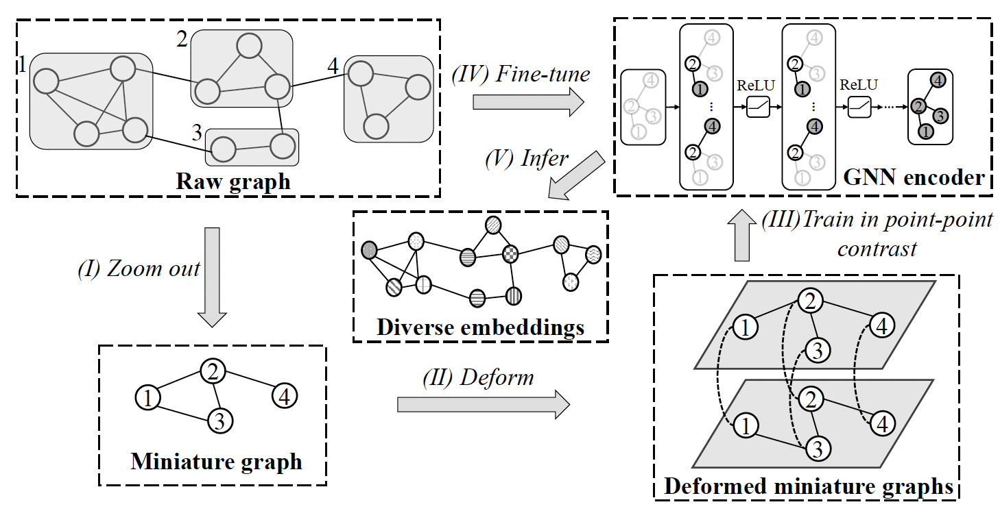

# Fast Unsupervised Graph Embedding via Graph Zoom Learning

[🔗 Paper](https://ieeexplore.ieee.org/abstract/document/10184803)

This repository contains the official implementation of **Graph Zoom Learning (GZL)**, a fast and effective framework for unsupervised graph representation learning.



## ✨ Highlights

- A graph zoom learning framework for fast unsupervised graph embedding
- Contrastive learning on coarsened graphs with information transferred back to the original graph
- Support for both node-level and graph-level representation learning
- Baseline implementations included for comparison
- A ready-to-run public example on **Cora**

## 📖 Overview

Graph embedding methods often face a trade-off between efficiency and representation quality, especially on large graphs. GZL addresses this issue by first learning on a coarsened graph, then using the learned structural knowledge to improve representations on the original graph. In this way, GZL aims to provide both strong performance and better scalability for unsupervised graph embedding.

This repository includes:

- The main implementation of GZL
- Example scripts for node-level and graph-level tasks
- Preprocessed coarsened data for a public Cora example
- Baseline methods in separate folders for comparison studies

## 🖼️ Framework

The figure above shows the main pipeline of Graph Zoom Learning. The method first builds a zoomed representation of the graph, performs learning in the coarsened space, and then transfers the learned information back for downstream representation learning.

## 📂 Repository Structure

```text
GZL/
  train_gzl.py                    # Main script for node-level experiments
  train_gzl_graph.py              # Main script for graph-level experiments
  model.py                        # Core model definition
  config.yaml                     # Dataset-specific hyperparameters
  scripts/                        # Example commands

data/
  0.1cora_coarsen_features.npy    # Coarsened features for the public Cora example
  0.1cora_coarsen_edge.npy        # Coarsened edges for the public Cora example

figures/                          # Visualization results
model.png                         # Method overview figure

baselines(contrastive)/           # Contrastive learning baselines
baselines(deepwalk+node2vec)/     # DeepWalk and Node2Vec baselines
```

## ⚙️ Installation

We recommend using a clean Python environment.

```bash
pip install -r requirements.txt
```

## 🚀 Quick Start

To reproduce the provided **Cora** example with **coarsening ratio = 0.1**:

```bash
cd GZL
python train_gzl.py --dataset Cora --coarsening_ratio 0.1
```

The current public version includes the preprocessed coarsened files needed for this setting.

## 🧪 Reproducibility

### Node-level experiment

Run the main GZL model on Cora:

```bash
cd GZL
python train_gzl.py --dataset Cora --coarsening_ratio 0.1
```

### Graph-level experiment

Example commands for graph-level tasks are provided in `GZL/scripts/run_graph.sh`.

### Baselines

Baseline implementations are available in:

- `baselines(contrastive)/`
- `baselines(deepwalk+node2vec)/`

## 🧩 Included Components

- `GZL/`: main implementation of Graph Zoom Learning
- `data/`: released preprocessed coarsened graph files
- `figures/`: visualization figures and analysis plots
- `baselines(contrastive)/`: contrastive graph learning baselines
- `baselines(deepwalk+node2vec)/`: DeepWalk and Node2Vec baselines

## 📌 Notes

- Due to repository size limits, the current public version provides one ready-to-run example setting: **Cora** with **coarsening ratio = 0.1**.
- The training code includes interfaces for additional datasets such as `CS`, `ogbn`, and several graph-level benchmarks, but the corresponding released preprocessing files in this repository are currently limited.
- The node-level training entry is `GZL/train_gzl.py`, and hyperparameters are defined in `GZL/config.yaml`.
- Example command scripts are available in `GZL/scripts/`.

## 📈 Visualization

The `figures/` folder contains several result visualizations, including t-SNE plots for GZL and baseline methods. These can be used to illustrate the representation quality learned by different models.

## 📌 Citation

If you find this repository useful in your research, please cite:

> Ziyang Liu, Chaokun Wang, Yunkai Lou, and Hao Feng. *Fast Unsupervised Graph Embedding via Graph Zoom Learning*. In **2023 IEEE 39th International Conference on Data Engineering (ICDE)**, pages 2551-2564, 2023. [🔗](https://ieeexplore.ieee.org/abstract/document/10184803)

```bibtex
@inproceedings{liu2023fast,
  author    = {Ziyang Liu and Chaokun Wang and Yunkai Lou and Hao Feng},
  title     = {Fast Unsupervised Graph Embedding via Graph Zoom Learning},
  booktitle = {2023 IEEE 39th International Conference on Data Engineering (ICDE)},
  pages     = {2551--2564},
  year      = {2023},
  doi       = {10.1109/ICDE55515.2023.00196}
}
```

If this repository is helpful to your work, please consider starring it.
